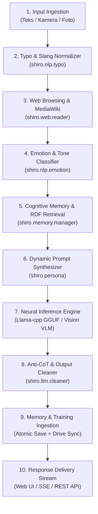

# 📐 Arsitektur Sistem Shiro LLMA

Dokumen ini menjelaskan rancangan arsitektur modular, alur pemrosesan pesan (neural execution pipeline), serta organisasi kode pada Shiro LLMA v2.5.

---

## 1. Alur Pemrosesan Pesan (Execution Pipeline)

Setiap interaksi pesan antara Kakak dan Shiro melewati 8 tahapan neural pipeline:



---

## 2. Struktur Modul & Paket

```
Shiro-LLMA/
├── app.py                      # Main entrypoint / Flask runner
├── web.py                      # Backward-compatible server & API endpoints
├── web_reader.py               # Shim kompatibilitas -> shiro.web.reader
├── typo_helper.py              # Shim kompatibilitas -> shiro.nlp.typo
├── memory_manager_v2.py        # Shim kompatibilitas -> shiro.memory.manager
├── memory_optimization.py      # Shim kompatibilitas -> shiro.memory.optimization
├── export_training_data.py     # CLI ekspor dataset -> shiro.training.exporter
│
├── shiro/                      # 📦 Paket Inti Modular
│   ├── __init__.py             # Versi dan metadata paket
│   ├── config.py               # Konstanta path, konteks, dan environment
│   ├── persona.py              # Single source of truth untuk System Prompt Shiro
│   │
│   ├── llm/                    # Inferensi & Pembersihan Output
│   │   ├── __init__.py
│   │   ├── cleaner.py          # Anti-CoT, pembersih token, preservasi newline
│   │   └── loader.py           # Preload CUDA Linux & loader Llama GGUF
│   │
│   ├── nlp/                    # Pemahaman Bahasa Alami
│   │   ├── __init__.py
│   │   ├── typo.py             # Kamus & normalizer typo chat Indonesia
│   │   └── emotion.py          # Klasifikasi emosi dan nada afektif
│   │
│   ├── memory/                 # Sistem Kognitif & Memori
│   │   ├── __init__.py
│   │   ├── manager.py          # AdvancedMemoryManager (RDF, Episodic, History)
│   │   ├── optimization.py     # Kompresi riwayat & alokasi token budget
│   │   └── drive_sync.py       # Backup & pemulihan otomatis Google Drive (Atomic)
│   │
│   ├── web/                    # Penjelajahan Web & Ensiklopedia
│   │   ├── __init__.py
│   │   └── reader.py           # Bypass Cloudflare Fandom/Wikipedia, HTML cleaner
│   │
│   ├── training/               # Dataset & Continuous Learning
│   │   ├── __init__.py
│   │   └── exporter.py         # Ekspor otomatis format Alpaca, ChatML, ShareGPT
│   │
│   └── pipeline/               # Visualizer & Trace
│       ├── __init__.py
│       └── trace.py            # Event broadcaster SSE & status trace node
│
├── data/
│   └── templates/              # Template awal memori bersih (ingatan_shiro.template.json)
├── tests/                      # Unit tests suite (100% lulus)
├── docs/                       # Dokumentasi arsitektur, konfigurasi, & docker
├── templates/                  # Frontend HTML (UI chat & neural visualizer)
└── static/                     # Frontend JS & CSS
```

---

## 3. Keunggulan Arsitektur Baru

1. **Zero Redundancy**: System prompt tidak lagi tersebar di berbagai file, melainkan terpusat di `shiro.persona`.
2. **Atomic State Persistence**: Penyimpanan file JSON menggunakan temporary write + atomic replace sehingga terhindar dari file korup jika Google Colab tiba-tiba terputus.
3. **High Privacy**: Dataset obrolan pribadi di GitHub berstatus bersih, dan otomatis dipulihkan dari Google Drive pribadi saat sesi Colab dijalankan.
4. **100% Backward Compatible**: Berkas `web.py`, `export_training_data.py`, dan `memory_manager_v2.py` tetap dapat dipanggil secara langsung oleh Colab, Docker, maupun script otomatis lainnya.
